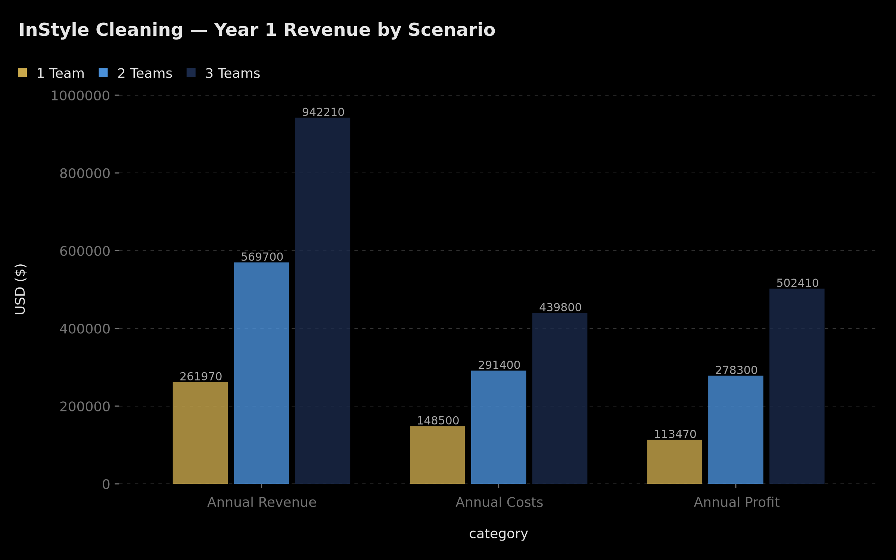
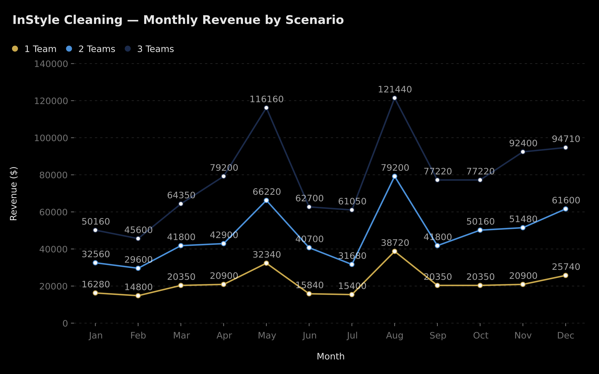
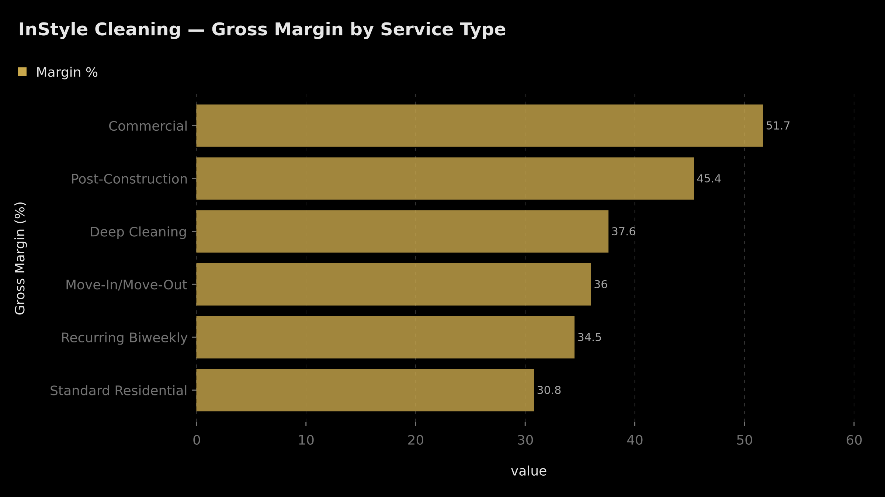
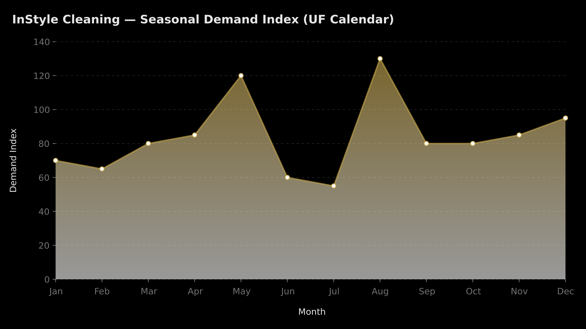
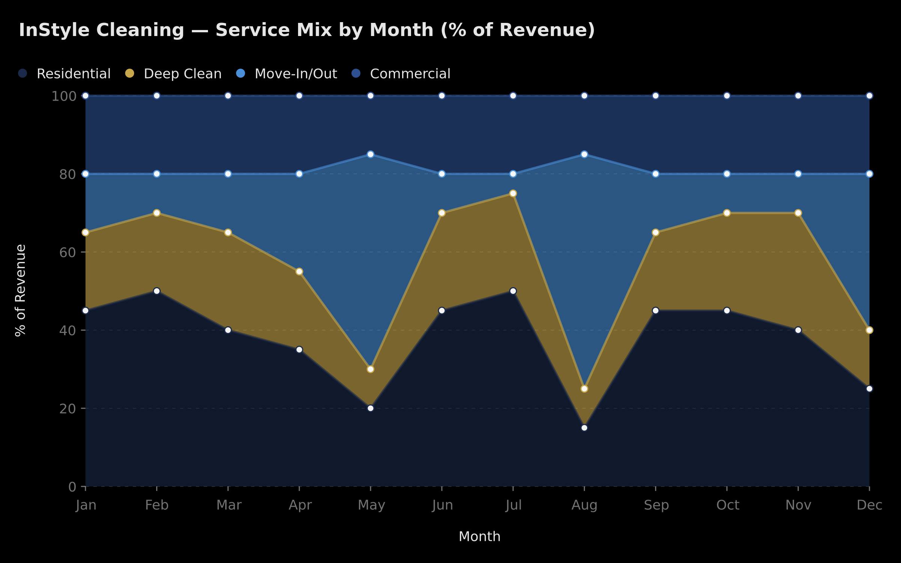
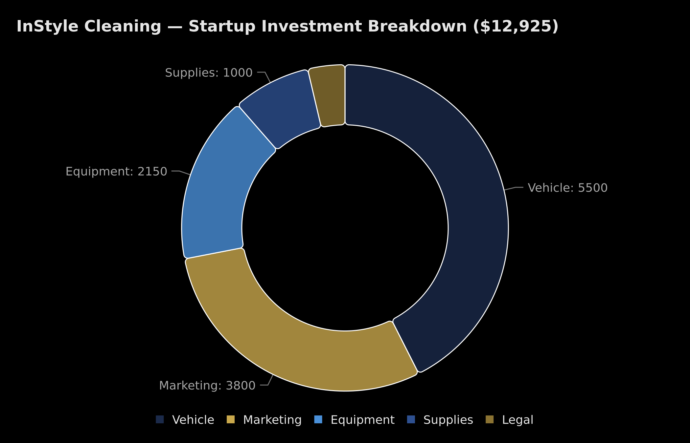
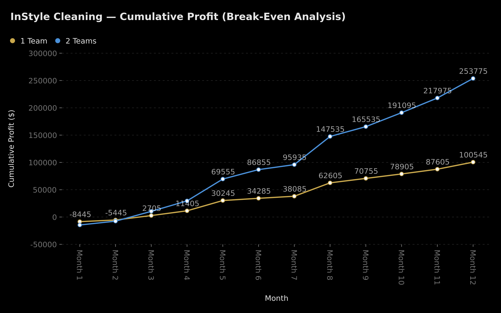

# InStyle Cleaning — Financial Analysis
### Premium Residential & Commercial Cleaning | Gainesville, FL → Orlando/Tampa Corridor
**Prepared: April 3, 2026** | **Brand Colors:** Navy `#1B2A4A` · Gold `#C9A84C`

---

## Executive Summary

InStyle Cleaning is positioned to capture a premium segment of the Gainesville cleaning market — a city with ~140K residents plus ~60K University of Florida students who create **two massive seasonal demand spikes** (August move-in, May move-out) unlike any other market in Florida.

| Metric | 1 Team | 2 Teams | 3 Teams |
|--------|--------|---------|---------|
| **Year 1 Revenue** | $261,970 | $569,700 | $942,210 |
| **Year 1 Profit** | $113,470 | $278,300 | $502,410 |
| **Net Margin** | 43.3% | 48.9% | 53.3% |
| **Break-Even** | Month 3 | Month 3 | Month 3* |
| **Startup Investment** | $12,925 | $24,525 | $36,125 |
| **ROI (Year 1)** | 878% | 1,135% | 1,391% |

*All three scenarios achieve positive cumulative profit by Month 3, driven by low startup costs and immediate cash-generating service model.*

**Recommendation:** Start with **2 Teams** — it balances risk ($24.5K investment) with strong returns ($278K profit) and provides redundancy for peak season surge capacity.

---

## 1. Revenue Scenarios

### Year 1 Annual Comparison

### Scenario Assumptions

| Parameter | 1 Team | 2 Teams | 3 Teams |
|-----------|--------|---------|---------|
| Cleaning teams | 1 (2 people) | 2 (4 people) | 3 (6 people) |
| Jobs/day (base) | 4-5 | 4-5 per team | 4-6 per team |
| Jobs/day (peak: May, Aug) | 7-8 | 7-8 per team | 8 per team |
| Working days/month | 20-22 | 20-22 | 20-22 |
| Avg revenue/job | $175-$220 | $180-$225 | $185-$230 |
| Monthly fixed costs | $8,795 | $16,590 | $24,385 |

### Monthly Revenue Trajectory

**Key insight:** The UF student calendar creates a **roller coaster** revenue pattern. August (fall move-in) and May (spring move-out) generate **2-2.5x** normal monthly revenue. Summer months (June-July) are the trough. Smart operators pre-sell August slots by May and maintain commercial contracts to smooth summer dips.

### Monthly Revenue Detail — 2 Teams (Recommended Scenario)

| Month | Jobs/Day | Avg $/Job | Revenue | Costs | Profit |
|-------|----------|-----------|---------|-------|--------|
| Jan | 4 | $185 | $32,560 | $22,600 | $9,960 |
| Feb | 4 | $185 | $29,600 | $22,600 | $7,000 |
| Mar | 5 | $190 | $41,800 | $23,800 | $18,000 |
| Apr | 5 | $195 | $42,900 | $23,800 | $19,100 |
| **May** | **7** | **$215** | **$66,220** | **$26,200** | **$40,020** |
| Jun | 5 | $185 | $40,700 | $23,400 | $17,300 |
| Jul | 4 | $180 | $31,680 | $22,600 | $9,080 |
| **Aug** | **8** | **$225** | **$79,200** | **$27,600** | **$51,600** |
| Sep | 5 | $190 | $41,800 | $23,800 | $18,000 |
| Oct | 6 | $190 | $50,160 | $24,600 | $25,560 |
| Nov | 6 | $195 | $51,480 | $24,600 | $26,880 |
| Dec | 7 | $200 | $61,600 | $25,800 | $35,800 |
| **TOTAL** | | | **$569,700** | **$291,400** | **$278,300** |

---

## 2. Service Margin Analysis

### Gross Margin by Service Type

### Detailed Margin Breakdown

| Service | Avg Price | Labor (hrs) | Labor Cost | Supplies | Travel | Total Cost | **Gross Profit** | **Margin** |
|---------|-----------|-------------|------------|----------|--------|------------|------------------|------------|
| Commercial (3000 sqft) | $540 | 6.0 | $108 | $35 | $10 | $261 | **$279** | **51.7%** |
| Post-Construction | $650 | 8.0 | $144 | $55 | $12 | $355 | **$295** | **45.4%** |
| Deep Cleaning | $375 | 5.5 | $99 | $28 | $8 | $234 | **$141** | **37.6%** |
| Move-In/Move-Out | $300 | 4.5 | $81 | $22 | $8 | $192 | **$108** | **36.0%** |
| Recurring Biweekly | $165 | 2.5 | $45 | $10 | $8 | $108 | **$57** | **34.5%** |
| Standard Residential | $185 | 3.0 | $54 | $12 | $8 | $128 | **$57** | **30.8%** |

> **Labor cost basis:** $18/hr per cleaner (2-person teams = $36/hr team cost). Gainesville average for cleaning staff is $14-16/hr; premium positioning justifies $18/hr for better talent retention.

### Monthly Gross Profit Potential (Per Team)

| Service | Jobs/Month | Revenue | Gross Profit |
|---------|------------|---------|--------------|
| Move-In/Move-Out | 35 | $10,500 | **$3,780** |
| Recurring Biweekly | 55 | $9,075 | **$3,135** |
| Deep Cleaning | 22 | $8,580 | **$3,102** |
| Commercial | 10 | $5,400 | **$2,790** |
| Standard Residential | 44 | $8,140 | **$2,508** |
| Post-Construction | 6 | $3,900 | **$1,770** |

### Strategic Insight: Service Mix Optimization

**Highest margin ≠ highest profit.** Commercial cleans at 51.7% margin are best per-job, but volume is limited. The real money maker is **Move-In/Move-Out** — 36% margin × high volume in peak months = the single largest profit driver. The optimal mix:

1. **Build a base** of recurring biweekly clients (predictable revenue, fills slow days)
2. **Chase peak seasons** with move-in/move-out capacity (May + August = ~$90K in 2 months with 2 teams)
3. **Layer commercial contracts** for summer stability (3-5 contracts smooth the June-July dip)
4. **Upsell deep cleans** to recurring clients quarterly

---

## 3. Seasonal Cash Flow (UF Calendar)

### Demand Index by Month

### UF Academic Calendar Impact

| Month | Demand | UF Event | Service Mix Shift | Revenue Driver |
|-------|--------|----------|-------------------|----------------|
| **Jan** | 🟡 70 | Spring semester starts | 15% move-in | New student arrivals |
| **Feb** | 🟡 65 | Mid-spring | Steady residential | Lowest demand period |
| **Mar** | 🟢 80 | Spring break prep | Spring cleaning surge | Deep cleans spike |
| **Apr** | 🟢 85 | Semester ending | Early move-outs | Lease turnover begins |
| **May** | 🔴 120 | **GRADUATION + MOVE-OUT** | **55% move-out** | **8,000+ students leaving** |
| **Jun** | 🟡 60 | Summer Session A | Back to residential | Summer slowdown |
| **Jul** | ⚪ 55 | Summer Session B | Lowest month | Only 30% UF population |
| **Aug** | 🔴 130 | **FALL MOVE-IN** | **60% move-in** | **BIGGEST month of year** |
| **Sep** | 🟢 80 | Fall semester underway | Recurring sign-ups | New recurring clients |
| **Oct** | 🟢 80 | Homecoming | Game-day deep cleans | UF event cleaning |
| **Nov** | 🟢 85 | Pre-holiday | Holiday deep cleans | Thanksgiving prep |
| **Dec** | 🟢 95 | Fall finals + graduation | 40% move-out | December graduates leave |

### Service Mix Shifts Throughout the Year

### Cash Flow Strategy

**Peak months (May + Aug):** These two months alone can generate **$145K revenue** with 2 teams — that's **25% of annual revenue** in just 2 months. Action items:
- Start booking move-out cleans in March (advertise to UF students via campus boards, social media)
- Hire 2-3 temporary cleaners for May and August surge
- Increase prices 10-15% during peak weeks (supply/demand justifies it)
- Partner with property management companies for guaranteed bulk deals

**Trough months (Jun-Jul):** Revenue drops ~40% from peaks. Counter-strategy:
- Lock in 3-5 commercial contracts (offices, restaurants, gyms) paying $1,500-$3,000/month
- Run "Summer Deep Clean Special" promotions for homeowners
- Use downtime for team training and process improvement
- Pre-sell August move-in packages at a 5% early-bird discount

---

## 4. Startup vs. Growth Costs

### Initial Investment Breakdown

### Startup Costs Detail (1 Team)

| Category | One-Time | Monthly | Notes |
|----------|----------|---------|-------|
| **Vehicle** | $5,500 | $850 | Van lease + wrap + gas |
| **Marketing** | $3,800 | $1,100 | Website, ads, campus, materials |
| **Equipment** | $2,150 | $0 | Vacuums, mops, buffers, ladders |
| **Supplies** | $1,000 | $400 | Cleaning products, PPE |
| **Legal** | $475 | $0 | LLC, license, bond |
| **Software** | $0 | $135 | CRM, accounting, comms |
| **Insurance** | $0 | $630 | GL, WC, auto |
| **Labor** | $0 | $9,000 | Owner + 1 lead + 1 member |
| **TOTAL** | **$12,925** | **$12,115** | |

### Scaling Costs: 1 → 2 → 3 Teams

| Cost Item | 1 Team | 2 Teams | 3 Teams |
|-----------|--------|---------|---------|
| Startup investment | $12,925 | $24,525 | $36,125 |
| Monthly fixed costs | $8,795 | $16,590 | $24,385 |
| Monthly variable costs (avg) | $3,200 | $6,400 | $9,600 |
| Monthly total costs (avg) | $11,995 | $22,990 | $33,985 |
| **Additional per-team cost** | — | +$11,600 | +$11,600 |

**What each additional team adds:**
- 1 cargo van lease: $450/mo
- Van wrap: $2,500 one-time
- Gas/maintenance: $400/mo
- 1 team lead: $3,200/mo
- 1 team member: $2,800/mo
- Workers comp: $180/mo
- Auto insurance: $200/mo
- Equipment set: $2,150 one-time
- Additional supplies: $200/mo
- **Total per-team add-on: $11,600 startup + $7,430/mo recurring**

---

## 5. Break-Even Analysis

### Cumulative Profit Trajectory

### Break-Even Timeline

| Scenario | Startup Cost | Monthly Burn (avg) | Break-Even Month | Cumulative Profit at Month 12 |
|----------|-------------|-------------------|-----------------|-------------------------------|
| **1 Team** | $12,925 | $11,995 | **Month 3** | **$100,545** |
| **2 Teams** | $24,525 | $22,990 | **Month 3** | **$253,775** |

Both scenarios break even in **Month 3** because:
1. Cleaning is a **cash-from-day-one** business — you clean, you get paid, same week
2. Fixed costs are relatively low (no inventory, no warehouse, no manufacturing)
3. Even at 4 jobs/day with 1 team, monthly revenue ($16K+) exceeds monthly costs ($12K)

### Sensitivity: What If Things Go Wrong?

| Scenario | Impact | Break-Even Shift |
|----------|--------|-----------------|
| 30% fewer jobs than projected | Revenue drops to $183K (1 team) | Month 5 |
| 20% price reduction (competition) | Revenue drops to $210K (1 team) | Month 4 |
| Key employee quits mid-year | Lost 2 weeks revenue + hiring cost | +1 month delay |
| Van breakdown | $2K repair + 1 week downtime | Minimal (still profitable) |
| Summer months worse than expected | Jun-Jul revenue drops 50% | Still Month 3 (absorbed by peaks) |

**Even in the worst case (30% fewer jobs), InStyle breaks even by Month 5 with 1 team.** This is an exceptionally resilient business model.

---

## 6. Expansion Roadmap: Gainesville → Orlando/Tampa

### Phase 1: Gainesville Domination (Months 1-12)
- Launch with 1-2 teams
- Capture UF student market (move-in/move-out)
- Build recurring residential base of 80-120 clients
- Secure 3-5 commercial contracts
- **Target: $500K+ annual run-rate**

### Phase 2: Orlando Expansion (Months 12-18)
- UCF has **72,000+ students** — even bigger than UF
- Orlando metro: 2.7M population
- Open satellite operation with 2 teams
- Replicate UF playbook at UCF
- **Additional investment: ~$30K**
- **Revenue potential: $400-600K additional Year 1**

### Phase 3: Tampa Corridor (Months 18-24)
- USF has **50,000+ students**
- Tampa Bay metro: 3.2M population
- Launch with 2 teams, scale to 4
- I-4 corridor connects all three markets
- **Revenue potential: $500-800K additional Year 1**

### 3-Year Revenue Projection

| Year | Gainesville | Orlando | Tampa | **Total** |
|------|------------|---------|-------|-----------|
| Year 1 | $570K | — | — | **$570K** |
| Year 2 | $750K | $500K | — | **$1.25M** |
| Year 3 | $900K | $800K | $600K | **$2.3M** |

---

## 7. Key Metrics Dashboard

### Unit Economics

| Metric | Value |
|--------|-------|
| Average revenue per job | $195 |
| Average cost per job | $125 |
| Average gross profit per job | $70 |
| Average gross margin | 36% |
| Jobs needed to cover monthly fixed ($16.6K for 2 teams) | 237/month (11/day) |
| Revenue per employee per month | ~$11,900 |
| Customer lifetime value (recurring biweekly, 18-mo avg) | $5,940 |
| Customer acquisition cost (estimated) | $50-120 |
| LTV:CAC ratio | ~50-120x |

### Financial Health Indicators

| Indicator | Year 1 (2 Teams) | Target |
|-----------|------------------|--------|
| Gross margin | 48.9% | >40% ✅ |
| Operating cash flow | $278,300 | Positive ✅ |
| Debt-to-equity | 0 (no debt) | <1.0 ✅ |
| Cash reserve (Month 12) | ~$253K | >3 months expenses ✅ |
| Revenue per team | $284,850 | >$250K ✅ |

---

## Appendix: Data Sources & Assumptions

- **Market size:** Gainesville population ~140K + ~60K UF students (US Census, UF enrollment data)
- **Pricing:** Based on premium positioning in Gainesville market ($120-250 residential, $250-500 deep clean, $200-400 move-out, $0.10-0.30/sqft commercial)
- **Labor rates:** $18/hr (above Gainesville average of $14-16/hr to attract/retain quality)
- **Jobs/day:** 4-8 per 2-person team (industry standard; premium jobs take longer)
- **Working days:** 22/month (Mon-Fri, occasional Saturday)
- **Seasonal patterns:** UF academic calendar (Aug move-in, May graduation, Dec graduation)
- **Growth rates:** Conservative estimates based on local market penetration

---

*Generated by InStyle Cleaning Financial Model v1.0 — All figures are projections based on market research and industry benchmarks. Actual results may vary based on execution, market conditions, and competitive dynamics.*
